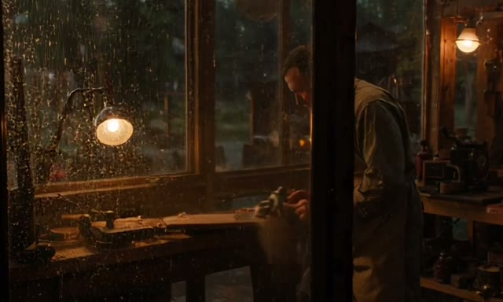
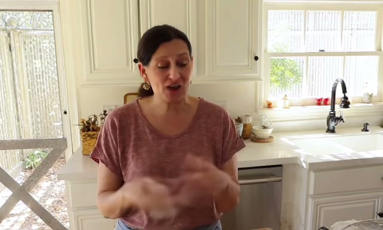
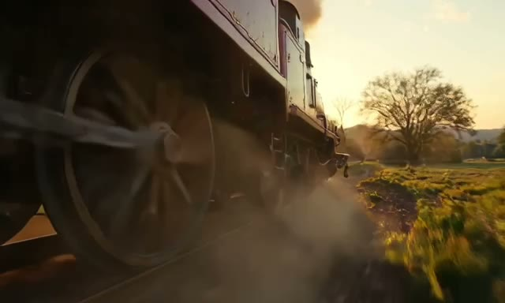

# ltx — LTX 2.5 on Apple silicon

Type a sentence, get a clip **with the sound already in it**. No GPU rental, no
Python environment, no node graph. One command, on your Mac.

```bash
ltx render --prompt "a red kite over a beach at sunset" --out kite.mp4
```

[](demo-media/workshop.mp4)

<sub>**A woodworker's shop in the rain.** 640×384, 4 s, 11 transformer forwards.
The rain on the glass, the plane, and the radio behind him were generated *with*
the picture rather than dubbed onto it. Click any still for the clip; GitHub will
not play video inline.</sub>

[LTX 2.5](https://huggingface.co/Lightricks/LTX-2.5) is an open-weights video
model that is unusual in one specific way: **it generates the picture and the
soundtrack in a single pass.** The transformer carries both streams and
cross-modal attention reads each into the other on every block, so a render is
never silent by construction. `ltx` is a native Swift and
[MLX](https://github.com/ml-explore/mlx) port of it, with no Python anywhere in
the render path.

---

## Will it run on my Mac?

The disk usually stops people first.

| | you need |
|---|---|
| **memory** | 64 GB unified for the measured shape, 96 GB and up for headroom |
| **disk** | 66 GB for the fast route, 113 GB for everything |
| **chip** | any Apple silicon |
| **macOS** | 14 or later |

A render at 640×384×97 peaks at **47.7 GB** of allocator memory, and the
two-stage route measured 41.0 GB against that plan. Larger shapes cost more:
attention is fused so memory grows with the token count rather than its square,
but the weights alone are 63 GB resident during sampling.

`ltx doctor` answers this for your actual machine in about a second, reading file
headers rather than file bodies. It ends with `no problems found` when you are
ready.

---

## 1. Build it

There is no installer yet — it is a Swift package, and you build it:

```bash
swift build -c release
./tools/build_mlx_metallib.sh --release      # the CLI you just built
swift build --build-tests                    # then, if you want to run the tests
./tools/build_mlx_metallib.sh
swift test
```

**The metallib step goes after each build, not once.** The script copies the
library beside whatever binaries exist *at the moment it runs* — the release CLI,
and the `.xctest` bundle — so a build that happens afterwards does not get one. It
takes a `--release` flag and otherwise works on the debug tree.

**The middle step is not optional and is not a workaround for a broken checkout.**
SwiftPM's command-line build does not compile `.metal` files at all, so mlx-swift
ships without the Metal library it expects to find and every MLX call fails at
device resolution — including on `Device(.cpu)`, since the default device resolves
during initialisation. [`docs/SWIFT_ARCHITECTURE.md`](docs/SWIFT_ARCHITECTURE.md)
has the diagnosis; the script's header has the lookup order, including the detail
that the colocated library is named `mlx.metallib` while the bundle one is
`default.metallib`.

## 2. Get the model files

The weights are **not** in this repository and are licensed separately by
Lightricks. LTX 2.5 splits every component into its own file; this port loads the
least-quantized path.

| file | size | what it does |
|---|---|---|
| `diffusion_models/ltx-2.5-22b-distilled-transformer-bf16` | 39 GB | the fast route — 11 forwards for a whole render |
| `diffusion_models/ltx-2.5-22b-dev-transformer-bf16` | 39 GB | the reference-quality route, 120 forwards |
| `text_encoders/gemma4-12b-with-proj-ltx-2.5-bf16` | 24 GB | reads your prompt |
| `vae/ltx-2.5-video-vae-conv-bf16` | 1.4 GB | turns latents into pixels |
| `vae/ltx-2.5-audio-vae-bf16` | 0.35 GB | turns latents into sound |
| `latent_upscale_models/…-spatial-upscaler-x2` | 0.95 GB | the x2 step between the two stages |
| `loras/ltx-2.5-22b-distilled-lora-450-bf16` | 8.3 GB | optional, for `--recipe dev-lora` |

**You do not need both of the big ones to start.** The distilled transformer alone
gives you the whole two-stage route, which is 16–17× faster than the dev one —
66 GB instead of 113 GB. Put them anywhere; `ltx` never moves or copies them.

Two files are easy to confuse. `vae/ltx-2.5-video-vae-bf16` carries the
**neighbourhood-attention** diffusion decoder, which needs an `na3d` kernel that
does not exist on Apple silicon. The one you want is `…-video-vae-conv-bf16`. The
int8 and nvfp4 transformer variants are not supported.

## 3. Point `ltx` at them

```bash
ltx doctor
```

That writes `~/.config/ltx/config.json` with the filenames already filled in. Set
one thing — the folder your models are in:

```json
{
  "checkpoints": {
    "root": "/Users/you/models/ltx/2.5"
  }
}
```

Then `ltx doctor` again. Every file is identified **from its own header, not its
name**, so one that has been renamed, truncated or converted differently is
reported as what it actually is — and the dev and distilled transformers are
byte-identical in structure, so that check is the only thing that can tell them
apart. When it says `no problems found`, you are ready.

## 4. Render something

```bash
ltx render --recipe distilled --prompt "a red kite over a beach at sunset" --out kite.mp4
```

```
starting render job...
encoding text (loading the 26 GB encoder; it is released before the DiT)
text encoded: valid tokens per branch [94]
step 1/11  26s elapsed
step 2/11  28s elapsed
...
wrote kite.mp4
wrote kite.provenance.json
```

The sidecar records every parameter, the checkpoint identities and how the latent
was drawn, so a clip can be traced back to what made it.

Every command checks itself before it starts: the Metal kernels, and every
checkpoint this run opens. It is header reads only, and it refuses with **all** the
problems it found and a fix for each rather than dying half a minute into a load
that was never going to finish.

---

## What you can make

| you want | how |
|---|---|
| video from a description | just `--prompt` |
| a character who speaks | put the words in the prompt, in quotes |
| start from your photo | `--image photo.png` |
| start here, end there | `--image a.png --last-frame b.png` |
| pin a shot mid-clip | `--keyframe b.png@48` |
| drive it from your own audio | `--audio speech.wav` |
| a cast of characters | `ltx msr -r alice.png -r bob.png` |
| enlarge a clip you already have | `ltx upscale` |

### A character who speaks

Put the dialogue in the prompt, in quotation marks, and say how it is delivered.
The mouth and the voice come out of the same pass:

```bash
ltx render --recipe distilled --out kitchen.mp4 --prompt \
  'Medium close-up, static frame: a woman in a sunlit kitchen, flour on her
   hands, looks at the camera and says "This is running on my own machine — no
   cloud, no rented GPU." Her voice is warm and close, with the knock of dough
   on wood underneath.'
```

[](demo-media/kitchen.mp4)

<sub>**640×384, 4 s, seed 7.** Nothing in this port measures a waveform — vocoder
output cannot be compared numerically at all, for the reason contract 11 in
[`FRAGILE_CONTRACTS.md`](docs/FRAGILE_CONTRACTS.md) gives — so speech and lip-sync
here are judged by eye and ear and are evidence the port is plausible, never
evidence it is correct.</sub>

### Motion, and the sound of it

[](demo-media/locomotive.mp4)

<sub>**640×384, 4 s, seed 3.** A tracking shot along the driving wheels. The
clank, the whistle and the hiss of steam are the same pass as the motion blur.</sub>

[](demo-media/heron.mp4)

<sub>**640×384, 4 s, seed 11.** The other register: mist, a slow push in, and two
wingbeats where the prompt asked for two. Its soundtrack averages −40 dB against
the kitchen's −17 — the model is not simply filling every clip with noise.</sub>

[`docs/PROMPTING.md`](docs/PROMPTING.md) has the full grammar — shot
establishment, camera moves, soundscape, dialogue — and is worth ten minutes if
you want reliable results.

### Reference conditioning

Two routes condition on images rather than the prompt alone, and they differ in
what they can keep apart. **`ltx ingredients`** takes one reference sheet — a
composite of the cast, props and location. **`ltx msr`** takes up to five separate
stills, each in its own slot, and keeps them distinguishable: a learned slot
vector goes into each reference's latent channels and each slot takes a distinct
negative time offset, so no two references share coordinates with each other or
with the target's own frame 0.

Both carry their reference tokens **in the video sequence** beside the generated
ones, held clean and dropped before the decode. That costs real sequence length —
five MSR slots at 640×384 add 6000 tokens against 3120 generated — so budget
memory from the total rather than the output size. `ltx recipes` prints both.

---

## All the commands

```
ltx doctor        what this Mac can run, which checkpoints it found
ltx recipes       the pipelines, their shapes, and which command runs each
ltx render        generate a clip from a prompt
ltx ingredients   generate from a prompt plus a reference sheet
ltx msr           generate from a prompt plus up to five reference stills
ltx upscale       enlarge a clip that already exists
ltx bench         measure this machine
```

`doctor` and `recipes` are the two worth running first. Between them they answer
"what can this machine do" and "how do I ask for it" without starting a render to
find out.

Useful `render` options:

| | |
|---|---|
| `--recipe distilled` | the fast route: 11 forwards instead of 120 |
| `--frames 97` | duration in frames, on the `8k+1` lattice |
| `--width` / `--height` | exact size, multiples of 64 |
| `--megapixels 0.6 --aspect-ratio 9:16` | or name a target and let it resolve |
| `--seed 7` | same seed, machine and version → the same clip |
| `--image photo.png --strength 0.9` | condition on a still |
| `--lora name@0.8` | stack an adapter, resolved by filename fragment |
| `--fps 24` | **not cosmetic** — it sets the audio latent count |

`ltx render --help` lists every one, and
[`docs/CLI.md`](docs/CLI.md) is the full reference.

---

## Speed and quality

Measured on a Mac Studio (M3 Ultra) at 640×384×97, 24 fps. Times are sampling;
reading the checkpoints costs about 25 s on top, once per run — the four clips
above each took roughly 70 s end to end.

| recipe | forwards | time | what it is |
|---|---|---|---|
| `distilled` *(start here)* | **11** | **~40 s** | 8-step draft at half size, x2 latent upsample, 3-step refine. No guidance at all |
| `prod` | 120 | ~13 min | single-stage, 30 steps, four guidance passes per step |

**The distilled route is 16–17× faster and it is not a degraded mode** — it is a
separate schedule the model was distilled for. It builds no guider, so
`--video-cfg`, `--stg-scale` and the rest are refused by name rather than
ignored.

**Guidance is what `prod` spends its time on.** Each non-neutral term costs a
transformer forward per step: CFG, STG and modality guidance are three, plus the
conditional pass. Narrowing a term's window (`--stg-start`/`--stg-end`) to exclude
every sampled sigma is bit-identical to switching it off, and free.

**Cross-step caching is off by default and stays off.** Swept: `--cache-threshold
0.10` is 2.78× and fails on viewing; 0.01 skips nothing and proves the probe costs
nothing. Judge any setting above 0 by eye —
[`docs/PERFORMANCE.md`](docs/PERFORMANCE.md) has the table with quality columns
beside the speed ones, which is the only form in which that trade is honest.

**Sampling is 97.3% of the wall clock.** Decode is 0.5% and text encode 0.7%, so
optimising anything but the transformer is optimising nothing.

---

## For developers

It is a Swift package as well as a tool. The render API is an actor, so one
process cannot start a second render by accident — a model this size must never be
loaded twice:

```swift
import LTX25

let job = try await RenderEngine.shared.startJob(request: request,
                                                 checkpoints: checkpoints,
                                                 memoryMarginFraction: 0.15)
for await event in job.events { print(event) }
```

MLX types never appear in the public API, which is what lets the attention
backend and the compute path change without breaking callers.

**On correctness.** This codebase's failure mode is *silent*: a wrong packed
layout, a dropped embedding or a transposed table all keep every tensor exactly
the right shape and produce a plausible clip.
[`docs/FRAGILE_CONTRACTS.md`](docs/FRAGILE_CONTRACTS.md) collects the constraints
that each cost a debugging session to find, with the evidence that established them —
why a seed is not portable across backends, why an empty negative prompt is 223
tokens rather than none, why a keyframe marker smaller than bf16 rounding is
still a real defect.

<details>
<summary><b>Architecture</b></summary>

Dependencies point downward only, and the four lowest targets do not link MLX — so
geometry, the frame lattice, safetensors headers, checkpoint identification, recipe
resolution and the memory planner all test in seconds with no GPU and no 39 GB
download. Those are exactly the places where an error stays silent.

| target | owns | MLX |
|---|---|---|
| `LTXFoundation` | errors, geometry, frame lattice, safetensors, tokenizer | no |
| `LTXHardware` | machine detection, the memory planner | no |
| `LTXCatalog` | checkpoint discovery, identification, topology | no |
| `LTXRecipes` | capability-aware recipe resolution | no |
| `LTXAttention` | the attention backend seam | yes |
| `LTXModules` | DiT, VAEs, vocoder, text encoder, LoRA training | yes |
| `LTXPipeline` | conditioning, layout, sampler, guidance, decode, mux | yes |
| `LTX25` | the public API and the actor-owned runtime | yes |
| `ltx` | the CLI | yes |

</details>

Further reading: [`docs/RECIPES.md`](docs/RECIPES.md) for how a pipeline is
chosen and what its evidence status claims, [`docs/TRAINING.md`](docs/TRAINING.md)
for training a LoRA through the library API, and
[`docs/SWIFT_ARCHITECTURE.md`](docs/SWIFT_ARCHITECTURE.md) for where the MLX
boundary sits and why.

## Status

Verified end to end through this package: text-to-video with joint audio at
640×384×97 on both the single-stage and two-stage routes, image and keyframe
conditioning, audio-driven video, the x2 upscaler in all three of its modes, and
reference conditioning through both the Ingredients IC-LoRA and MSR.

**What the tests do and do not tell you.** `swift test` runs 601 tests. A large
part needs no checkpoints at all and runs on a bare checkout in seconds; the rest
**skip** when the config does not resolve a checkpoint, and the framework counts a
skip as a pass. Read the count alongside `ltx doctor`.

**No numeric check consumes a rendered clip or a waveform.** A render is judged by
eye, and the contracts are what argue the arithmetic under it is right.

Not done:

- **Smaller machines.** 64 GB is the floor for the measured shape and there is no
  quantised or streamed path to go below it.
- **The NA-diffusion video decoder**, which needs an `na3d` Metal kernel that does
  not exist. The causal conv decoder is what this port uses.
- **Temporal upscaling.** The x2 temporal upscaler ships in the model release and
  is not wired here.
- **A `train` subcommand.** LoRA training runs, but through the library API only.

## Licence

**Apache License 2.0** — every source file carries the SPDX identifier. Use it for
anything, including commercially and in closed-source products. Modify it, fork
it, ship it.

Two things travel with it: keep the copyright and the [`NOTICE`](NOTICE) file in
what you distribute, and state that you changed the files you changed.

The model weights are not in this repository and are licensed separately by
Lightricks. `patches/mlx-m3-ultra-large-m-gemm.patch` is a change to
[mlx-swift](https://github.com/ml-explore/mlx-swift), which is MIT licensed.

> **If you verify the signature on a built binary**, `codesign -dv` reports
> `Developer ID Application: Tesserapps, LLC`, which is not the name on the
> copyright above. That is expected: the copyright is personal and Tesserapps is
> the Apple developer account whose certificates sign the binaries.
